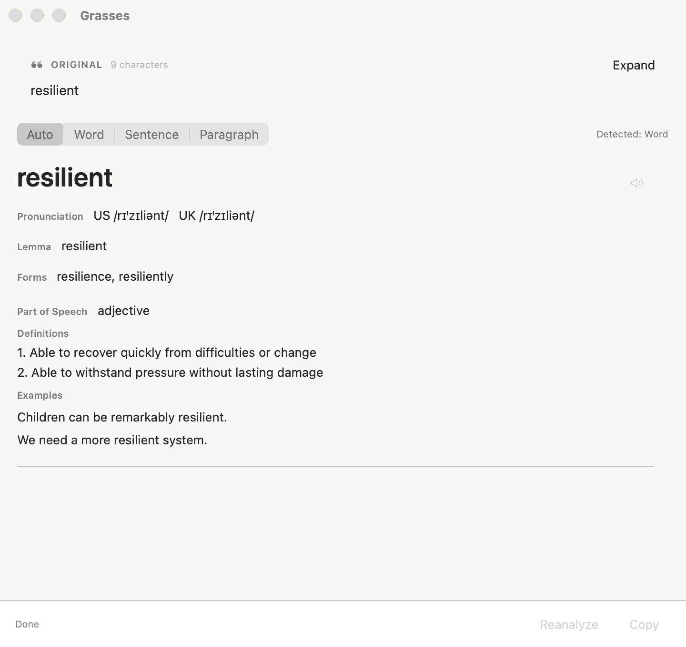
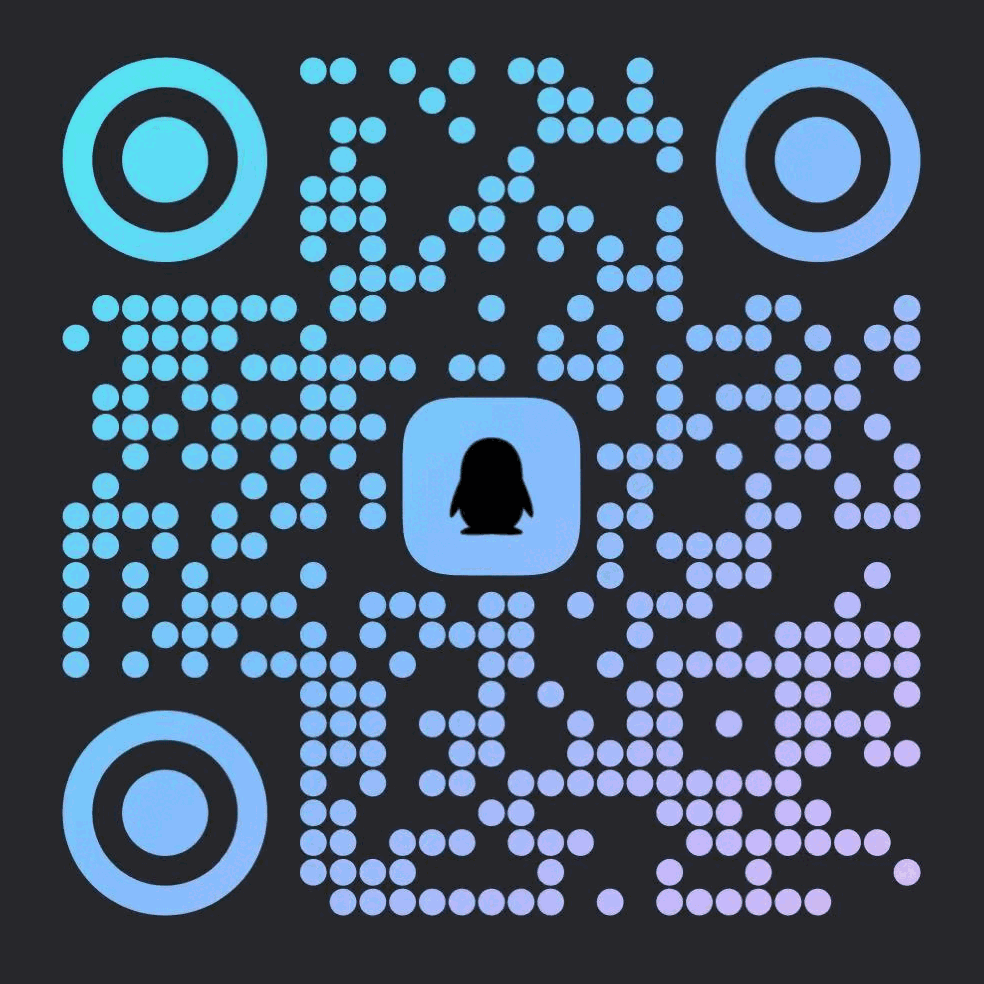

  

<h1 align="center">Grasses</h1>

<strong>Stay where you are. Understand English.</strong>

  <a href="README.zh-CN.md">简体中文</a>
  ·
  <a href="https://grasses.brainbeats.pro">Website</a>
  ·
  <a href="https://github.com/Brain-Beats/grasses-release/releases">Download</a>
  ·
  <a href="https://pay.ldxp.cn/item/vqjuqm">Buy Pro</a>
  ·
  <a href="https://grasses.brainbeats.pro/privacy.html?lang=en">Privacy</a>

Grasses is a native macOS menu bar companion for reading English. Select text, read from the clipboard, or capture text from an image, then get the analysis beside the content you are already reading.

This repository is the official distribution channel for Grasses. It hosts release packages, release notes, and the signed Sparkle update feed published with public releases.

## Download

Published builds are available from [GitHub Releases](https://github.com/Brain-Beats/grasses-release/releases). If no release is listed yet, the first public build has not been published.

1. Open the latest available release and download `Grasses.dmg`.
2. Open the disk image and drag Grasses into Applications.
3. Launch Grasses. It stays in the menu bar instead of opening a permanent main window.
4. Choose an AI Provider, enter your own API key, and test the connection.
5. Start with the Free features, or activate Grasses Pro from Settings -> General -> License.

## Read Without Leaving Your Place

Grasses keeps the reading workflow close to the text instead of sending you through another browser tab or application.

| Input | Default shortcut | Access | What it does |
| --- | --- | --- | --- |
| Selected text | `Option + G` | Free | Reads the text selected in another app, then restores the previous clipboard contents. |
| Clipboard text | `Option + Shift + G` | Free | Analyzes text you copied explicitly. |
| Clipboard image | `Option + Shift + G` | Pro | Recognizes a copied image locally and presents clickable text blocks. |
| Screen region | `Option + Control + G` | Pro | Captures a region, recognizes its text locally, and presents clickable text blocks. |

Shortcuts can be customized in Settings. On macOS 15 or later, newly recorded shortcuts that use Option must also include Command or Control; the existing defaults remain available.

## Results Adapt to the Text

- **Words and short phrases (Free):** lemma, IPA, common forms, parts of speech, definitions, examples, and on-device system pronunciation.
- **Sentences:** Free provides translation. Pro adds parallel grammar analysis with configurable colors for subjects, predicates, objects, complements, modifiers, and other roles.
- **Paragraphs:** Free provides a complete translation. Pro adds on-demand analysis of individual sentences with results reused during the current session.
- **Images (Pro):** Vision OCR runs on the Mac, preserves recognized line positions and reading order, and lets you select a specific text block for analysis.

## Free and Pro

Grasses can be downloaded and used without a License. Grasses Pro includes every Free feature and unlocks deeper image, sentence, and paragraph workflows.

| Feature | Free | Pro |
| --- | :---: | :---: |
| Selection and clipboard text reading | Yes | Yes |
| AI word and short-phrase analysis | Yes | Yes |
| Basic translation and automatic input classification | Yes | Yes |
| Copy, reanalyze, AI Provider configuration, appearance, and general app settings | Yes | Yes |
| Image text reading with on-device OCR | - | Yes |
| Sentence grammar analysis and role coloring | - | Yes |
| Sentence-by-sentence paragraph drill-down | - | Yes |
| Manual reading mode override | - | Yes |
| Custom grammar colors | - | Yes |

[Buy Grasses Pro](https://pay.ldxp.cn/item/vqjuqm)

## Activate Grasses Pro

1. Purchase Grasses Pro from the [official store](https://pay.ldxp.cn/item/vqjuqm) and obtain the complete `GRS1` activation code from the order delivery details.
2. Open Grasses from the menu bar, then choose Settings -> General -> License.
3. Paste the complete activation code and select Activate.
4. Activation is complete when the License status shows Grasses Pro as active.

- No Grasses account, email address, or email verification code is required.
- One purchase permanently unlocks Grasses Pro in current and future versions; the License is not restricted to a Grasses version.
- The first activation requires an internet connection. The signed Activation Token is then stored in the local macOS Keychain for offline verification.
- A Pro License does not include third-party AI service usage. You continue using your own API key and are responsible for any provider charges.
- Keep the original activation code private so it can be used again after reinstalling or moving to another Mac.

## AI Providers

Grasses connects directly from your Mac to the service you configure. Built-in defaults are available for:

- SiliconFlow
- DeepSeek
- Zhipu
- Kimi
- Mimo
- Qwen

You provide the API key and choose the model. Credentials are stored in macOS Keychain, and providers with fixed model support reject unsupported model names instead of silently changing them.

## Permissions

Grasses asks for a system permission only when you use the related workflow:

- **Accessibility:** required for Read Selection. After you trigger the command, Grasses simulates Copy, reads the selected text, and restores the previous clipboard contents.
- **Screen Recording:** required for Read Image. It is used only for the screen region you select; Grasses does not continuously record or scan the screen in the background.
- **Clipboard reading:** requires no additional system permission and only runs after your command.

You can revoke either system permission in System Settings at any time. Other workflows remain available.

## Privacy

- Grasses has no account system and operates no relay server for reading content.
- Screenshots and clipboard images stay on your Mac and are used only for local Vision OCR.
- Only the text you choose to analyze is sent directly to your configured AI service.
- API keys stay in macOS Keychain.
- Grasses creates no reading or image history.
- Diagnostic logs exclude API keys, screenshots, full selected or OCR text, and full AI responses.

Before sending sensitive text, review the privacy terms and account settings of the AI Provider you selected. See the complete [Privacy Policy](https://grasses.brainbeats.pro/privacy.html?lang=en) for data handling, retention, and deletion details.

## System Requirements

- macOS 13 or later
- Apple silicon or Intel Mac
- Your own API key for AI word and phrase analysis, translation, and grammar analysis. On-device OCR and system speech do not make AI service requests.

## Support

- QQ Community (China): `1075924792` for setup, activation help, usage questions, and release updates
- Email: [support@grasses.brainbeats.pro](mailto:support@grasses.brainbeats.pro)
- Issues: [GitHub Issues](https://github.com/Brain-Beats/grasses-release/issues)
- Website: [grasses.brainbeats.pro](https://grasses.brainbeats.pro)

  

When reporting a problem, do not include API keys, complete `GRS1` activation codes, Activation Tokens, private reading content, screenshots containing sensitive information, or full AI responses.
