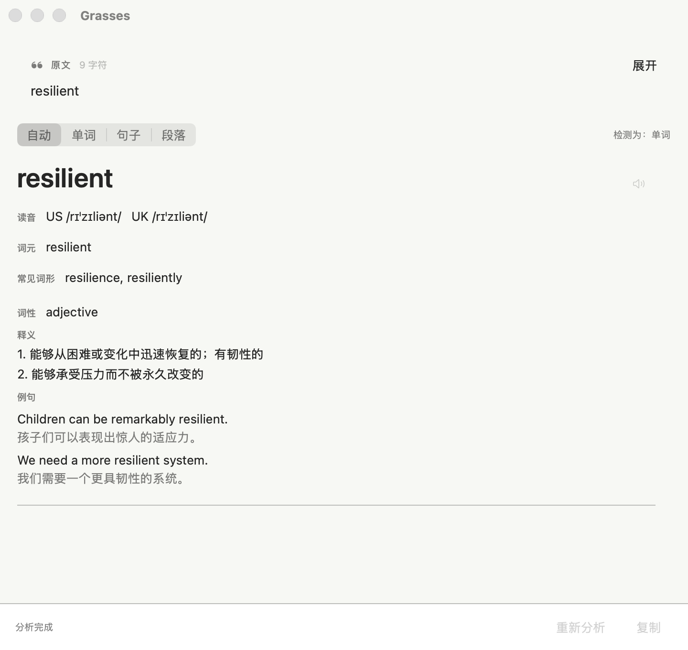

  

<h1 align="center">Grasses</h1>

<strong>留在原处，读懂英文。</strong>

  <a href="README.md">English</a>
  ·
  <a href="https://grasses.brainbeats.pro">官方网站</a>
  ·
  <a href="https://github.com/Brain-Beats/grasses-release/releases">下载</a>
  ·
  <a href="https://pay.ldxp.cn/item/vqjuqm">购买 Pro</a>
  ·
  <a href="https://grasses.brainbeats.pro/privacy.html?lang=zh-CN">隐私政策</a>

Grasses 是一款原生 macOS 菜单栏英语阅读工具。你可以选中文字、读取剪贴板，或框选图片中的文字，然后在当前阅读内容旁边查看分析结果。

这个公开仓库是 Grasses 的官方分发渠道，用于托管正式安装包、版本说明，以及随公开版本发布的签名 Sparkle 更新源。应用源代码在其他位置独立维护。

## 下载与安装

已发布的版本可从 [GitHub Releases](https://github.com/Brain-Beats/grasses-release/releases) 下载。如果页面中尚无 Release，说明首个公开版本还未发布。

1. 打开当前最新的可用 Release，下载 `Grasses.dmg`。
2. 打开磁盘映像，将 Grasses 拖入“应用程序”文件夹。
3. 启动 Grasses。它会常驻菜单栏，不会持续占用一个主窗口。
4. 选择 AI Provider，填写你自己的 API Key，并测试连接。
5. 直接使用 Free 功能，或前往“设置 → 通用 → License”激活 Grasses Pro。

公开发布的正式安装包为同时支持 Apple 芯片和 Intel Mac 的通用版本，使用 Developer ID 证书签名，并经过 Apple 公证。

## 留在当前阅读现场

Grasses 将理解过程放在正在阅读的文字旁边，减少在浏览器标签和其他应用之间来回切换。

| 输入方式 | 默认快捷键 | 使用权限 | 工作方式 |
| --- | --- | --- | --- |
| 选中文字 | `Option + G` | Free | 读取其他应用中当前选中的文字，完成后恢复原来的剪贴板内容。 |
| 剪贴板文字 | `Option + Shift + G` | Free | 分析你主动复制的文字。 |
| 剪贴板图片 | `Option + Shift + G` | Pro | 在本机识别复制的图片，并展示可点击的文本块。 |
| 屏幕区域 | `Option + Control + G` | Pro | 框选屏幕区域，在本机识别文字，并展示可点击的文本块。 |

所有快捷键均可在设置中修改。在 macOS 15 及以上版本中，新录制的 Option 快捷键必须同时包含 Command 或 Control；现有默认快捷键仍可使用。

## 根据文本提供不同结果

- **单词与短语（Free）：**提供词元、IPA、常见词形、词性、释义和例句，并使用 macOS 本机语音朗读。
- **句子：**Free 提供基础翻译；Pro 进一步提供并行语法分析，以可配置颜色标出主语、谓语、宾语、补语、修饰语等句子成分。
- **段落：**Free 提供全文翻译；Pro 可按需分析其中某一句，并在当前会话中复用已有结果。
- **图片（Pro）：**使用本机 Vision OCR，保留文字行位置和阅读顺序，并允许选择具体文本块继续分析。

## Free 与 Pro

Grasses 无需 License 即可下载和使用。Grasses Pro 包含 Free 的全部功能，并解锁更深入的图片、句子与段落阅读能力。

| 功能 | Free | Pro |
| --- | :---: | :---: |
| 划词与剪贴板文字阅读 | 支持 | 支持 |
| AI 单词与简短短语分析 | 支持 | 支持 |
| 基础翻译与自动输入识别 | 支持 | 支持 |
| 复制、重新分析、AI Provider 配置、外观与常规应用设置 | 支持 | 支持 |
| 图片文字阅读（本机 OCR） | - | 支持 |
| 句子语法分析与成分着色 | - | 支持 |
| 段落逐句深入分析 | - | 支持 |
| 手动切换阅读模式 | - | 支持 |
| 自定义语法颜色 | - | 支持 |

[购买 Grasses Pro](https://pay.ldxp.cn/item/vqjuqm)

## 激活 Grasses Pro

1. 在 [Grasses 官方店铺](https://pay.ldxp.cn/item/vqjuqm)购买，并从订单交付信息中获取完整的 `GRS1` 激活码。
2. 点击菜单栏中的 Grasses，打开“设置 → 通用 → License”。
3. 粘贴完整激活码，然后点击“激活”。
4. License 状态显示 Grasses Pro“已激活”即表示激活成功。

- 激活不需要注册 Grasses 账号，不需要填写邮箱，也不需要邮箱验证码。
- 一次购买，永久解锁当前及未来版本的 Grasses Pro；License 不限制 Grasses 版本。
- 首次激活需要连接网络。成功后，签名的 Activation Token 保存在本机 macOS 钥匙串中，可供离线验证。
- Pro License 不包含第三方 AI 服务费用；你仍需使用自己的 API Key，并自行承担 Provider 可能产生的费用。
- 请妥善保管原始激活码，以便重新安装或更换 Mac 后再次激活。

## AI 服务

Grasses 会从你的 Mac 直接连接到你配置的服务。应用内置以下 Provider 的默认配置：

- SiliconFlow
- DeepSeek
- 智谱
- Kimi
- Mimo
- 千问

API Key 由你自行提供，模型由你选择。凭据保存在 macOS 钥匙串中；对于仅支持固定模型列表的 Provider，Grasses 会明确拒绝不受支持的模型，而不是静默替换。

## 权限说明

Grasses 只会在你使用对应功能时请求系统权限：

- **辅助功能：**用于“读取选中内容”。你主动触发命令后，Grasses 会模拟复制、读取选中文字，然后恢复之前的剪贴板内容。
- **屏幕录制：**用于“阅读图片”。它只处理你手动框选的屏幕区域；Grasses 不会持续录屏，也不会在后台扫描屏幕。
- **剪贴板读取：**不需要额外系统权限，仅在你主动执行命令后运行。

你可以随时在“系统设置”中撤销权限，不使用该权限的其他工作方式仍然可用。

## 隐私

- Grasses 不要求注册账户，也不运营接收阅读内容的中转服务器。
- 截图和剪贴板图片留在 Mac 本机，仅用于 Vision OCR。
- 只有你选择分析的相关文本会直接发送到当前配置的 AI 服务。
- API Key 保存在 macOS 钥匙串中。
- Grasses 不建立阅读历史或图片历史。
- 诊断日志不包含 API Key、截图、完整选中文本、完整 OCR 文本或完整 AI 响应。

提交敏感文字前，请先确认所选 AI Provider 的隐私政策和账户设置符合你的需要。完整的数据处理、保留和删除说明请参阅[隐私政策](https://grasses.brainbeats.pro/privacy.html?lang=zh-CN)。

## 系统要求

- macOS 13 或更高版本
- Apple 芯片或 Intel Mac
- AI 单词与短语分析、翻译和语法分析需要你自己的 API Key；本机 OCR 和系统发音不会请求 AI 服务

## 支持

- 邮箱：[support@grasses.brainbeats.pro](mailto:support@grasses.brainbeats.pro)
- 问题反馈：[GitHub Issues](https://github.com/Brain-Beats/grasses-release/issues)
- 官网：[grasses.brainbeats.pro](https://grasses.brainbeats.pro)

反馈问题时，请勿提交 API Key、私人阅读内容、包含敏感信息的截图或完整 AI 响应。
